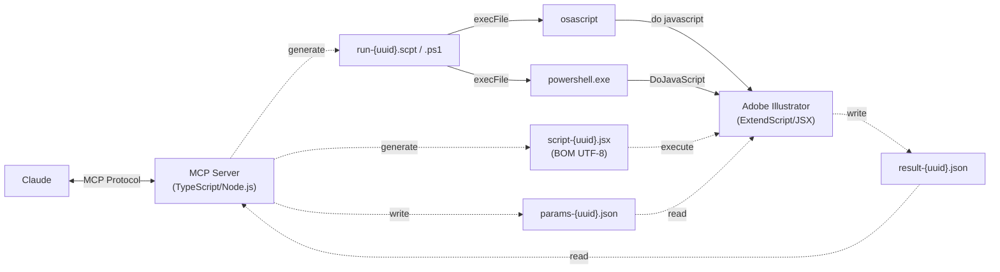

**🇺🇸 English** | [🇯🇵 日本語](README.ja.md) | [🇨🇳 简体中文](README.zh-CN.md) | [🇰🇷 한국어](README.ko.md) | [🇪🇸 Español](README.es.md) | [🇩🇪 Deutsch](README.de.md) | [🇫🇷 Français](README.fr.md) | [🇵🇹 Português (BR)](README.pt-BR.md)

> 🇯🇵 日本語の README は [README.ja.md](README.ja.md) にあります。

# Illustrator MCP Server

[](https://www.npmjs.com/package/illustrator-mcp-server)
[](LICENSE)
[]()
[](https://www.adobe.com/products/illustrator.html)
[](https://modelcontextprotocol.io/)
[](https://ko-fi.com/cyocun)

An [MCP (Model Context Protocol)](https://modelcontextprotocol.io/) server for reading, manipulating, and exporting Adobe Illustrator design data — with 63 built-in tools.

Control Illustrator directly from AI assistants like Claude — extract design information for web implementation, verify print-ready data, and export assets.

Everything Adobe's official Illustrator MCP (beta) can do — and more. See the [comparison](#-comparison-with-adobes-official-illustrator-mcp).

[](https://glama.ai/mcp/servers/ie3jp/illustrator-mcp-server)

---

## 🎨 Gallery

All artwork below was created entirely by Claude through natural language conversation — no manual Illustrator operation involved.

<table>
<tr>
<td align="center"><br><b>Event Poster</b></td>
<td align="center"><br><b>Logo Concepts</b></td>
</tr>
<tr>
<td align="center"><br><b>Business Card</b></td>
<td align="center"><br><b>Twilight Geometry</b></td>
</tr>
</table>

> See [detailed breakdowns](#example-smpte-test-pattern) below for prompts, tool usage, and artboard structure.

---

> [!TIP]
> Developing and maintaining this tool takes time and resources.
> If it helps your workflow, your support means a lot — [☕ buy me a coffee!](https://ko-fi.com/cyocun)

---

## 🚀 Quick Start

### 🛠️ Claude Code

Requires [Node.js 20+](https://nodejs.org/).

```bash
claude mcp add illustrator-mcp -- npx illustrator-mcp-server
```

### 🖥️ Claude Desktop

1. Download **`illustrator-mcp-server.mcpb`** from [GitHub Releases](https://github.com/ie3jp/illustrator-mcp-server/releases/latest)
2. Open Claude Desktop → **Settings** → **Extensions**
3. Drag and drop the `.mcpb` file into the Extensions panel
4. Click the **Install** button

<details>
<summary><strong>Alternative: manual config (always up to date via npx)</strong></summary>

> [!NOTE]
> The `.mcpb` extension does not auto-update. To update, download the new version and reinstall. If you prefer automatic updates, use the npx method below instead.

Requires [Node.js 20+](https://nodejs.org/). Open the config file and add the connection settings.

#### 1. Open the config file

From the Claude Desktop menu bar:

**Claude** → **Settings...** → **Developer** (in the left sidebar) → Click the **Edit Config** button

#### 2. Add the settings

```json
{
  "mcpServers": {
    "illustrator": {
      "command": "npx",
      "args": ["illustrator-mcp-server"]
    }
  }
}
```

> [!NOTE]
> If you installed Node.js via a version manager (nvm, mise, fnm, etc.), Claude Desktop may not find `npx`. In that case, use the full path:
> ```json
> "command": "/full/path/to/npx"
> ```
> Run `which npx` in your terminal to find the path.

#### 3. Save and restart

1. Save the file and close the text editor
2. **Fully quit** Claude Desktop (⌘Q / Ctrl+Q) and reopen it

</details>

> [!CAUTION]
> AI can make mistakes. Do not over-rely on the output — **always have a human perform the final check on submission data**. The user is responsible for the results.

> [!NOTE]
> **macOS:** On first run, allow automation access in System Settings > Privacy & Security > Automation.

> [!NOTE]
> Modify and export tools will bring Illustrator to the foreground during execution.

### Multiple Illustrator Versions

If you have multiple versions of Illustrator installed, you can tell Claude which version to use during conversation. Just say something like "Use Illustrator 2024" and the `set_illustrator_version` tool will target that version.


**Supported versions:** Illustrator 2024 (v28) and later are verified. Illustrator 2020–2023 (v24–v27) are expected to work — every ExtendScript API this server uses has existed since v24 — but they are **not verified**, so tools return a warning when running on them. Versions older than 2020 (v24) are rejected. If something breaks on an unverified version, please [open an issue](https://github.com/ie3jp/illustrator-mcp-server/issues).
> [!NOTE]
> If Illustrator is already running, the server connects to the running instance regardless of the version setting. The version is only used to launch the correct version when Illustrator is not yet running.

---

## 🎬 What You Can Do

```
You:    Show me all the text information in this document
Claude:  → list_text_frames → get_text_frame_detail
         There are 12 text frames in the document.
         The heading "My Design" uses Noto Sans JP Bold 48px, color #333333 ...
```

```
You:    Run a pre-press preflight check
Claude:  → preflight_check
         ⚠ 2 warnings:
         - Low resolution image: image_01.jpg (150dpi) — 300dpi or higher recommended
         - Non-outlined fonts: 3 text frames
```

```
You:    Check text for inconsistencies
Claude:  → check_text_consistency
         📝 Consistency Report:
         ⚠ "Contact Us" vs "Contact us" — capitalization mismatch
         ❌ "Lorem ipsum" (2 places) — placeholder text remaining
```

```
You:    Create banner size variations from this A4 flyer
Claude:  → get_document_info → resize_for_variation
         Created 3 size variations:
         - 728×90 / 300×250 / 160×600
```

---

## 🆚 Comparison with Adobe's Official Illustrator MCP

**In short: everything the official MCP does, this project does too — plus a lot more.** Adobe ships a built-in MCP server in **Illustrator Beta** (30.4+, still beta-only as of August 2026), focused on analyzing and batch-processing existing documents. This project covers those same workflows — analysis, bulk recoloring, variations, batch artboard export, font / broken-link checks — and adds what the official server doesn't have: **creating artwork from scratch, saving documents, print & prepress checks, and design-system tools**. And it runs on stable Illustrator, no beta required.

| | This project | Adobe official MCP (beta) |
|---|---|---|
| Installation | npm (`npx illustrator-mcp-server`) or one-click `.mcpb` install | Built into Illustrator Beta — get an auth key + URL from the app settings, connect via `mcp-remote` |
| Supported versions | Illustrator 2024+ verified / 2020+ unverified (macOS / Windows) | Illustrator Beta 30.4+ only |
| Number of tools | 67 | ~40 |
| Analyzing & batch-processing existing documents | ✅ Structure / color / font analysis, bulk recolor, variations & datasets, batch artboard export (`artboard:all`), font & broken-link preflight | ✅ Its main focus |
| Creating objects from scratch | ✅ Full set — documents, shapes, paths, text frames, path text, gradients | ❌ No new objects, text frames, or documents \* |
| Saving documents | ✅ `save_document` (save / save-as) | ❌ Export only \* |
| Print & prepress | ✅ Crop marks, preflight, overprint / separation info, outlines, color profiles | — |
| Design system | ✅ Design tokens, WCAG contrast check, style guides, text consistency | — |

\* Based on user reports as of April 2026 (beta). The official server is under active development — see [Adobe's documentation](https://helpx.adobe.com/illustrator/desktop/connect-with-other-apps-and-tools/about-using-ai-tools-with-illustrator.html) for the latest status.

---

## 📖 Recipes

<details>
<summary><b>Extract colors and fonts for CSS</b></summary>

```
You:    Summarize the colors and typography in this design

Claude:  → get_colors → list_text_frames → get_text_frame_detail

         ■ Color Palette
         - Primary: #1A73E8 (CMYK: 85,50,0,0)
         - Secondary: #34A853
         - Text: #202124
         - Background: #FFFFFF

         ■ Typography
         - Headings: Noto Sans JP Bold / 32px
         - Body: Noto Sans JP Regular / 16px / line-height: 1.75
         - Captions: Noto Sans JP Medium / 12px
```

</details>

<details>
<summary><b>Export artboards as SVG / PNG</b></summary>

```
You:    Export all artboards as SVG with outlined text

Claude:  → get_artboards → convert_to_outlines → export (repeated)

         Exported 4 artboards:
         - /output/header.svg
         - /output/hero.svg
         - /output/feature.svg
         - /output/footer.svg
```

</details>

<details>
<summary><b>Check PDF/X-1a compliance before submission</b></summary>

```
You:    Check if this document is PDF/X-1a compliant

Claude:  → preflight_check (target_pdf_profile: "x1a")

         ❌ PDF/X-1a compliance errors:
         - Transparency on 3 objects (X-1a prohibits transparency)
         - RGB colors found in 2 places (X-1a requires CMYK/spot only)

         ⚠ Warnings:
         - 5 non-outlined fonts (embedding recommended)
         - Image "photo_02.jpg" at 150dpi (300dpi recommended)
```

</details>

<details>
<summary><b>Check image quality for print</b></summary>

```
You:    Check placed image quality for print

Claude:  → get_images (include_print_info: true)

         ■ Image Quality Report:
         ✅ hero.psd — CMYK, 350dpi, scale 98%
         ⚠ icon_set.png — RGB (mismatch with CMYK document), 300dpi, scale 100%
         ❌ photo_bg.jpg — CMYK, 72dpi, scale 400% (over-enlarged)
           → Replace with a 300dpi+ image at actual size
```

</details>

<details>
<summary><b>Check WCAG color contrast ratios</b></summary>

```
You:    Check text contrast ratios

Claude:  → check_contrast (auto_detect: true)

         ■ WCAG Contrast Report:
         ❌ "Caption" on "light gray" — 2.8:1 (AA fail)
         ⚠ "Subheading" on "white" — 4.2:1 (AA Large OK, AA Normal fail)
         ✅ "Body text" on "white" — 12.1:1 (AAA pass)
```

</details>

---

## Workflow Templates

Pre-built workflow templates available in the Claude Desktop prompt picker.

| Template | Description |
|----------|-------------|
| `quick-layout` | Paste text content and Claude arranges it on the artboard as headings, body, and captions |
| `print-preflight-workflow` | Comprehensive 7-step pre-press check (document → preflight → overprint → separations → images → colors → text) |

---

## Tool Reference

### Read Tools (21)

<details>
<summary>Click to expand</summary>

| Tool | Description |
|---|---|
| `get_document_info` | Document metadata (dimensions, color mode, profile, etc.) |
| `get_artboards` | Artboard information (position, size, orientation) |
| `get_layers` | Layer structure as a tree |
| `get_document_structure` | Full tree: layers → groups → objects in one call |
| `list_text_frames` | List of text frames (font, size, style name) |
| `get_text_frame_detail` | All attributes of a specific text frame (kerning, paragraph settings, etc.) |
| `get_colors` | Color information in use (swatches, gradients, spot colors). `include_diagnostics` for print analysis |
| `get_path_items` | Path/shape data (fill, stroke, anchor points) |
| `get_groups` | Groups, clipping masks, and compound path structure |
| `get_effects` | Effects and appearance info (opacity, blend mode) |
| `get_images` | Embedded/linked image info (resolution, broken link detection). `include_print_info` for color space mismatch & scale factor |
| `get_symbols` | Symbol definitions and instances |
| `get_guidelines` | Guide information |
| `get_overprint_info` | Overprint settings + K100/rich black detection & intent classification |
| `get_separation_info` | Color separation info (CMYK process plates + spot color plates with usage counts) |
| `get_selection` | Details of currently selected objects |
| `find_objects` | Search by criteria (name, type, color, font, etc.) |
| `check_contrast` | WCAG color contrast ratio check (manual or auto-detect overlapping pairs) |
| `extract_design_tokens` | Extract design tokens as CSS custom properties, JSON, or Tailwind config |
| `list_fonts` | List fonts available in Illustrator (no document required) |
| `convert_coordinate` | Convert points between artboard and document coordinate systems |

</details>

### Modify Tools (39)

<details>
<summary>Click to expand</summary>

| Tool | Description |
|---|---|
| `create_rectangle` | Create a rectangle (supports rounded corners) |
| `create_ellipse` | Create an ellipse |
| `create_line` | Create a line |
| `create_text_frame` | Create a text frame (point or area type) |
| `create_path` | Create a custom path (with Bezier handles) |
| `place_image` | Place a raster/PDF image file as linked or embedded (SVG is rejected — use `import_svg_as_editable`) |
| `import_svg_as_editable` | Import an SVG file as editable Illustrator paths/text/groups (not as a linked image) |
| `modify_object` | Modify properties of an existing object |
| `convert_to_outlines` | Convert text to outlines |
| `assign_color_profile` | Assign (tag) a color profile (does not convert color values) |
| `create_document` | Create a new document (size, color mode) |
| `close_document` | Close the active document |
| `resize_for_variation` | Create size variations from a source artboard (proportional scaling) |
| `align_objects` | Align and distribute multiple objects |
| `replace_color` | Find and replace colors across document (with tolerance) |
| `manage_layers` | Add, rename, show/hide, lock/unlock, reorder, or delete layers |
| `place_color_chips` | Extract unique colors and place color chip swatches outside artboard |
| `save_document` | Save or save-as the active document |
| `open_document` | Open a document from file path |
| `group_objects` | Group objects (supports clipping masks) |
| `ungroup_objects` | Ungroup a group, releasing children |
| `duplicate_objects` | Duplicate objects with optional offset |
| `set_z_order` | Change stacking order (front/back) |
| `move_to_layer` | Move objects to a different layer |
| `delete_objects` | Delete objects by UUID (locked objects need `force_unlock`; reversible with `undo`) |
| `manage_artboards` | Add, remove, resize, rename, rearrange artboards |
| `manage_swatches` | Add, update, or delete swatches |
| `manage_linked_images` | Relink or embed placed images |
| `manage_datasets` | List/apply/create datasets, import/export variables |
| `apply_graphic_style` | Apply a graphic style to objects |
| `list_graphic_styles` | List all graphic styles in the document |
| `apply_text_style` | Apply character or paragraph style to text |
| `list_text_styles` | List all character and paragraph styles |
| `create_gradient` | Create gradients and apply to objects |
| `create_path_text` | Create text along a path |
| `place_symbol` | Place or replace symbol instances |
| `select_objects` | Select objects by UUID (multi-select supported) |
| `create_crop_marks` | Create crop marks (trim marks) with locale-based style auto-detection (Japanese double-line / Western single-line) |
| `place_style_guide` | Place a visual style guide outside the artboard (colors, fonts, spacing, margins, guide gaps) |
| `undo` | Undo/redo operations (multi-step) |

</details>

### Export Tools (2)

<details>
<summary>Click to expand</summary>

| Tool | Description |
|---|---|
| `export` | SVG / PNG / JPG export (by artboard, selection, or UUID) |
| `export_pdf` | Print-ready PDF export (crop marks, bleed, selective downsampling, output intent) |

</details>

### Utility (3)

<details>
<summary>Click to expand</summary>

| Tool | Description |
|---|---|
| `preflight_check` | Pre-press check (RGB mixing, broken links, low resolution, white overprint, transparency+overprint interaction, PDF/X compliance, etc.) |
| `check_text_consistency` | Text consistency check (placeholder detection, notation variation patterns, full text listing for LLM analysis) |
| `set_workflow` | Set workflow mode (web/print) to override auto-detected coordinate system |

</details>

---

## Coordinate System

The server automatically detects the coordinate system from the document:

| Document type | Coordinate system | Origin | Y axis |
|---|---|---|---|
| CMYK / Print | `document` | Bottom-left | Up |
| RGB / Web | `artboard-web` | Top-left of artboard | Down |

- **CMYK documents** use Illustrator's native coordinate system, matching what print designers expect
- **RGB documents** use a web-style coordinate system that is easier for AI to work with
- Use `set_workflow` to override the auto-detected coordinate system if needed
- All tool responses include a `coordinateSystem` field indicating which system is active

---

## Example: SMPTE Test Pattern

A 1920×1080 SMPTE color bar test pattern, created entirely through natural language instructions to Claude.

**Prompt:**

> Make a 1920x1080 video test pattern

**Result:**


**Artboard structure** (via `get_document_structure`):

<details>
<summary>Click to expand</summary>

```
Labels
├── title-safe-label        (text)    — "TITLE SAFE (10%)"
├── action-safe-label       (text)    — "ACTION SAFE (5%)"
├── credit-label            (text)    — "Generated by illustrator-mcp-server"
├── test-label              (text)    — "SMPTE COLOR BARS — TEST PATTERN"
├── format-label            (text)    — "Full HD — 16:9"
└── resolution-label        (text)    — "1920 x 1080"

Center Cross
├── title-safe              (path)    — 1536×864 stroke rectangle
├── action-safe             (path)    — 1728×972 stroke rectangle
├── cross-circle            (path)    — 150×150 center circle
├── cross-v                 (path)    — vertical crosshair
└── cross-h                 (path)    — horizontal crosshair

Color Bars
├── pluge-black … pluge-navy   (path ×9)  — PLUGE / grayscale bottom strip
├── rev-white … rev-blue       (path ×7)  — reverse color middle strip
└── bar-white … bar-blue       (path ×7)  — 75% SMPTE color bars
```

</details>

> Tools used: `create_document`, `manage_layers`, `create_rectangle` ×23, `create_line` ×2, `create_ellipse`, `create_text_frame` ×6, `modify_object` ×4, `save_document`, `export`

---

## Example: Twilight Geometry

An abstract geometric landscape artwork — created entirely by Claude, with no human design direction beyond "make whatever art you want."

**Prompt:**

> Make an art piece of your own imagination in Illustrator. Take your time. Create whatever you like.

**Claude's process:**

> I'll create "Twilight Geometry" — an abstract landscape with geometric celestial elements. A deep gradient twilight sky, layered mountain silhouettes, a crescent moon with decorative rings, and stars scattered across the canvas.

> Diamond-shaped stars in different colors — warm whites, cool blues, lavender purples — each one subtly different to suggest different types of stars. Constellation lines connecting them. Wireframe triangles and a hexagon floating in the sky for a mystical atmosphere.

> A water surface at the bottom with the moon's light reflected as shimmering wavy lines, fading as they descend.

**Claude's reflection:**

> It turned out better than I expected. I think the hybrid world of geometry and nature came through well.

**Result:**


> Tools used: `create_document`, `manage_layers` ×4, `create_rectangle` ×2, `create_gradient` ×2, `create_path` ×11, `create_ellipse` ×14, `create_line` ×4, `create_text_frame` ×2, `modify_object`, `set_z_order`, `export`

---

## Known Limitations

| Limitation | Details |
|---|---|
| Windows support | Windows uses PowerShell COM automation (not yet tested on real hardware) |
| Live effects | Drop shadow and other effect parameters can be detected but not read |
| Color profiles | Color profile assignment only — full conversion is not available |
| Bleed settings | Bleed settings cannot be read (Illustrator API limitation) |
| WebP export | Not supported — use PNG or SVG instead |
| Japanese crop marks | PDF export automatically uses the TrimMark command approach: generates marks as document paths, exports, then removes via undo |
| Font embedding | Embedding mode (full/subset) cannot be controlled directly — use PDF presets |
| Size variations | Proportional scaling only — text may need manual adjustment afterward |

---

<br>

# For Developers

## Architecture



---

## Building from Source

```bash
git clone https://github.com/ie3jp/illustrator-mcp-server.git
cd illustrator-mcp-server
npm install
npm run build
claude mcp add illustrator-mcp -- node /path/to/illustrator-mcp-server/dist/index.js
```

### Verify

```bash
npx @modelcontextprotocol/inspector npx illustrator-mcp-server
```

### Testing

```bash
# Unit tests
npm test

# E2E smoke test (requires Illustrator running)
npx tsx test/e2e/smoke-test.ts
```

The E2E test creates fresh documents (RGB + CMYK), places test objects, runs 182 test cases across 10 phases covering all registered tools and coordinate system auto-detection, and cleans up automatically.

---

## Special Thanks

Thanks to the following people for feedback that shaped this project:

- [OKI Yoshiya (@448jp)](https://github.com/448jp)

---

## Disclaimer

This tool automates many Illustrator operations, but AI can make mistakes. Extracted data, preflight results, and document modifications should always be reviewed by a person. **Do not rely on this tool as your sole quality check.** Use it as an assistant alongside your own manual verification, especially for print submissions and client deliverables. The authors are not responsible for any damages or losses arising from the use of this software or its outputs.

---

## License

[MIT](LICENSE)
